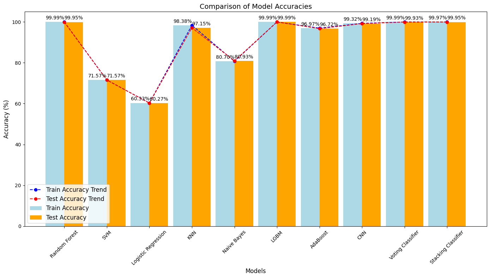

# Comparative Analysis of Machine Learning Algorithms for 5G Coverage Prediction

## Overview
This project focuses on predicting 5G network coverage by analyzing various machine learning algorithms. A comparative study was conducted using 10 different algorithms to evaluate their performance in terms of accuracy, precision, recall, and F1-score. A Stacking Classifier was utilized for optimized predictions by combining base models.

---

## Objectives
- To predict 5G network coverage using key parameters such as latitude, longitude, RSRP, SNR, and more.
- To evaluate and compare the performance of various machine learning algorithms.
- To develop a robust and efficient predictive model using an ensemble approach.

---

## Dataset
- The dataset contains parameters such as:
  - **Geographical data**: Latitude, Longitude
  - **Signal metrics**: RSRP, RSRQ, RSSI, SNR
  - **Network metrics**: DL bitrate, UL bitrate
- Preprocessing steps included:
  - Handling missing values
  - Scaling numerical data
  - Encoding categorical variables

---

## Machine Learning Models
The following algorithms were implemented and evaluated:
1. Logistic Regression
2. Random Forest Classifier
3. Support Vector Machine (SVM)
4. K-Nearest Neighbors (KNN)
5. AdaBoost
6. LGBM
7. Naive Bayes
8. CNN
9.Voting Classifier
10. Stacking Classifier

---


---

## Methodology
1. **Data Preprocessing**:
   - Cleaning and encoding data
   - Splitting into training and testing sets (70-30 split)
2. **Feature Engineering**:
   - Identified key features impacting 5G coverage.
3. **Model Training and Evaluation**:
   - Trained each model using the training set.
   - Evaluated using metrics such as accuracy, precision, recall, and F1-score.
4. **Ensemble Approach**:
   - Combined base models using the Stacking Classifier for optimized results.

---

## Results
- The Stacking Classifier outperformed individual models with improved accuracy and performance metrics.
- Detailed insights into algorithmic performance were obtained through comparative analysis.

---

## Tools and Technologies
- **Programming Language**: Python
- **Libraries**: Scikit-learn, Pandas, NumPy, Matplotlib, Seaborn

---

## Conclusion
This project demonstrated the effectiveness of ensemble learning in predicting 5G coverage. By comparing multiple algorithms, we identified the most suitable models and improved predictive accuracy through a Stacking Classifier.

---

## Future Work
- Incorporating additional features such as user mobility and environmental factors.
- Extending the study to real-time 5G coverage prediction.

---

## How to Run
1. Install required libraries:
   ```
   pip install scikit-learn, pandas, numpy ,matplotlib,lightbgm, seaborn
   ```
2. Load the dataset into the script.
3. Execute the script to preprocess data, train models, and evaluate results.
4. Run the code in terminal ``` python app.py ```
---



